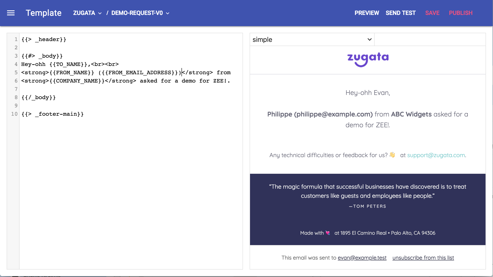

# SquareSerpent

SquareSerpent is a self-hosted transactional email editor and delivery service.
It provides a web-based email template editor similar to Mandrill or SendGrid
and an AWS lambda function for delivering mail.  It grew out of a desire to use
advanced features for building email templates in a web-based tool, such as
template partials and test data.  These features were found lacking in
exisiting transactional email platforms.




## Features

- web-based template editor with live preview
- uses Handlebars for email templates and supports all features of Handlebars
  4, including partials
- allows sample data to be provided for rendering previews and sending test
  email
- stores email templates transparently in Amazon S3
- provides an AWS Lambda function for sending transactional email
- supports i18n for templates


## Try it out

Install [Docker Desktop](https://www.docker.com/products/docker-desktop).
Then, from the project root, run

```sh
docker-compose build
docker-compose up
```

Once the services are running, you can play with the email template editor at
<http://localhost:8000/>.  When you send a test email, it will show up in
Mailcatcher, running at <http://localhost:1080>.


## Deploying

### Deploying the Template Editor

The template editor is deployed as a single Docker container, so you can use
your preferred Docker platform.  All configuration is done via environment
variables.  Take a look at [docker-compose.yml](docker-compose.yml) to see
which variables must be provided and other deployment details.

### Deploying the Email Delivery Service

The service for delivering emails is provided as an AWS Lambda function,
located in the [lambda](lambda) folder.  There are deployment instructions in
[lambda/README.md](lambda/README.md).


## Todo

- docs
- testing


## License

Released under the MIT License. See [LICENSE](LICENSE).
